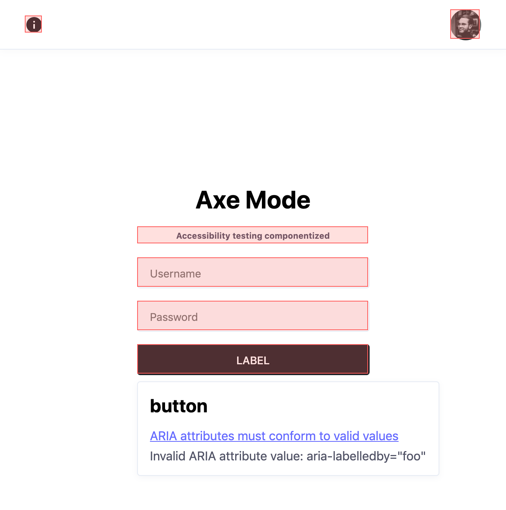

# axe-mode



> WIP

This project is an attempt to leverage [`axe-core`](https://github.com/dequelabs/axe-core) in a component to find accessibility violations and provide information on how to resolve them.

Currently, this only works for React.


## Usage

Make sure to have `axe-core` installed as a dependency.

Install the library:

```bash
yarn add axe-mode -D
```

or

```bash
npm install axe-mode --save-dev
```

Import the component and wrap it around your application or any other component tree you would like to validate:

```tsx
import AxeMode from 'axe-mode';

function App() {
  return (
    <AxeMode disabled={process.env.NODE_ENV !== 'development'}>
      <h1 aria-expanded="123">Hello world!</h1>
    </AxeMode>
  );
}
```

Launch your application as usual. Any violations of accessibility will show up as an overlay.

**Note**: Make sure not to run this in production by using the `disabled` prop with your environment variable.
